# 框架架构

相关文档：

- [技术设计说明](technical-design.md)
- [模块技术地图](module-map.md)
- [TODO Plan](roadmap.md)
- [模块文档索引](modules/README.md)

```mermaid
graph TB
    CLI["cli 终端界面"] --> Agent["agent 智能体核心"]
    Web["web 浏览器界面"] --> Gateway["gateway 后端网关"]
    Gateway --> Agent
    Gateway --> Core["gateway.core 配置/日志/中间件/异常"]
    Gateway --> Services["gateway.services 服务容器"]
    Gateway --> Sessions["gateway.sessions run/session 状态"]
    Gateway --> Streaming["gateway.streaming SSE/WebSocket 边界"]
    Gateway --> Auth["gateway.auth 鉴权授权"]
    Agent --> Models["agent.models 模型协议"]
    Agent --> Assembly["agent.assembly 装配入口"]
    Agent --> Config["agent.config 配置解析"]
    Agent --> Specs["agent.specs 规格定义"]
    Agent --> Capabilities["agent.capabilities 能力接入"]
    Agent --> Context["agent.context 上下文"]
    Agent --> Tools["agent.capabilities.tools / MCP"]
    Capabilities --> WebSearch["agent.capabilities.web Tavily 搜索"]
    Capabilities --> SandboxExec["agent.capabilities.sandbox 执行租约"]
    Agent --> Hooks["agent.hooks"]
    Agent --> State["agent.state 状态域"]
    State --> StateRuns["runs 运行记录"]
    State --> StateIdentity["identity 身份引用"]
    State --> StateWorkspaces["workspaces 工作区"]
    State --> StateAgents["agents Agent profiles"]
    Agent --> Governance["agent.governance 治理域"]
    Governance --> GovernancePolicy["permissions/credentials"]
    Governance --> GovernanceAudit["audit 审计记录"]
    Governance --> GovernanceTracing["tracing 链路追踪"]
    Agent --> Orchestration["agent.orchestration 多智能体编排"]
    Agent --> Tasks["agent.tasks 长程任务引擎"]
    Agent --> Memory["agent.capabilities.memory"]
    Agent --> Workflows["agent.workflows"]
```

## 顶层边界

- `agent`: 智能体系统核心。按 specs、runtime、context、models、capabilities 主链路组织，并用 `state` 收束长期状态，用 `governance` 收束权限、凭证、审计和追踪。该层不依赖 FastAPI。
- `gateway`: 后端网关。负责 HTTP API、请求/响应协议转换、鉴权、中间件、异常处理、日志、服务生命周期、SSE 和 Web UI 静态产物挂载。
- `cli`: 终端界面。面向本地交互，直接复用 `agent` 核心能力。
- `web`: 浏览器界面。通过 gateway HTTP/SSE API 调用智能体能力。

## Agent 核心层

- `agent.schema`: Message、ToolCall、ToolSpec、ModelRequest、ModelResponse、RuntimeEvent 等核心数据结构。
- `agent.specs`: Agent 规格层。`AgentSpec` 统一描述模型、工具、skills、workspace、权限 profile、记忆 profile 和 metadata。
- `agent.assembly`: SDK 装配入口。负责把 settings、模型配置、工具、skills、MCP、workspace、context 和 hooks 组装成 `AgentSession`，并提供 sync/async 两种入口。
- `agent.config`: 配置解析边界。负责模型 provider fallback、API key/base URL/model/proxy 解析。
- `agent.capabilities`: 能力域聚合包。收束 tools、skills、MCP 装配、web search 和 memory store，避免能力相关代码散落在 `agent` 顶层。
- `agent.capabilities.web`: control-plane web search 能力。当前内置 Tavily REST provider，统一输出 sources、usage 和 request_id；API key 不进入 sandbox。
- `agent.capabilities.sandbox`: 执行资源边界。定义 `SandboxClient`、local/Docker provider、profile、artifact 目录、lease/event/snapshot store。workspace 是持久化数据，sandbox 是工具执行租约。
- `agent.runtime`: 智能体内核包。`loop` 负责单 Agent 执行循环，`turns.model` 负责单轮模型请求，`turns.tools` 负责工具执行边界，`state` 承载运行状态，`session` 负责会话历史，`checkpoints` 负责断点恢复存储协议。
- `agent.models`: 模型协议包。`adapters` 负责 provider wire protocol，`protocol` 负责 provider-neutral stream 语义，`transports` 负责 HTTP/SSE，根层保留模型客户端、retry 和错误类型。
- `agent.context`: 上下文系统。按 system、runtime policy、workspace instructions、skills、memory、tool hints 分层组织上下文，由 `ContextBuilder` 编译并输出 trace；`ModelRequestCompiler` 负责把 runtime state 转为模型请求。
- `agent.context.memory` / `agent.context.compaction`: memory retrieval 与上下文压缩边界。前者把 memory store 转成 context fragments，后者把长对话折叠为可注入摘要。
- `agent.state`: 状态域聚合包。收束 runs、identity、agent profiles、workspace records，避免这些数据域散落在顶层。
- `agent.state.runs`: 运行记录边界。定义 `RunRecord`、`RunStore`、内存、本地 JSON 和 SQLite 存储。
- `agent.state.identity`: 身份引用边界。定义 Principal、Tenant/User/Agent 引用和 `IdentityStore`；登录鉴权仍属于 gateway。
- `agent.state.agents`: Agent profile 边界。负责长期保存可复用 Agent 定义，持久化时不保存 API key。
- `agent.state.workspaces`: 数据隔离边界。包含 workspace 分配器和 `WorkspaceStore`，负责 workspace 归属、路径、状态和 metadata。
- `agent.persistence`: 本地持久化基础设施。当前提供 SQLite schema、连接管理和 JSON codec，不承载具体业务语义。
- `agent.governance`: 治理域聚合包。收束 tool permissions、credential refs、audit、tracing、sandbox、security。
- `agent.governance.sandbox`: workspace sandbox policy、工具风险分类、文件/进程/网络执行授权边界。
- `agent.governance.tool_impact`: 模型工具调用的可解释 impact 描述，给 approval UI、trace 和 audit 使用。
- `agent.governance.security`: secret redaction 与 payload protection provider 协议；本地 base64 provider 只用于测试和开发，不是生产加密。
- `agent.governance.audit`: 可追溯审计边界。记录需要长期留存和追责的用户/系统决策，当前包含带 impact payload 的 tool approval audit。
- `agent.governance.tracing`: 运行链路追踪边界。记录 run/model/tool/approval span，用于调试、可观测性和用户可见时间线，不替代审计记录。
- `agent.capabilities.tools`: 工具注册表、builtin 工具和 MCP stdio 工具接入；`builtin` 只暴露语义工具。文件/patch/本地搜索/命令/测试/browser fetch 通过 `agent.capabilities.sandbox.SandboxClient` 进入 workspace，`web.search/extract/map` 通过 `agent.capabilities.web` 留在 control plane。
- `agent.hooks`: Runtime 扩展点，支持意图引导、thinking 提取、审批拦截和组合 hook。
- `agent.capabilities.skills`: skill manifest、prompt fragment、工具名声明加载。
- `agent.orchestration`: 多智能体 planner/router/supervisor 的归属边界。当前定义 agent roles、handoff decision 和 router 协议。
- `agent.tasks`: 长程任务引擎地基。定义 task、step、attempt 状态机、memory/SQLite stores、TaskRunner 和 task queue/worker。
- `agent.capabilities.memory`: session memory 和 long-term memory 的归属边界。当前定义 `MemoryRecord` 和 memory store，后续由 `agent.context` 按作用域注入上下文。
- `agent.workflows`: DAG、计划执行、多步骤任务流的归属边界。当前定义 workflow node/edge/plan 和拓扑校验。

## Gateway 网关层

- `gateway.api`: FastAPI routes、schemas、Agent chat 和 stream API。
- `gateway.core`: settings、logger、middleware、exceptions。
- `gateway.shared.server`: FastAPI 注册器、统一响应、请求 ID、server launcher。
- `gateway.auth`: 鉴权授权边界。
- `gateway.services`: 跨 API 的服务容器边界。当前提供 `GatewayPersistence`，统一创建 run/checkpoint/trace/audit/identity/profile/workspace/memory/credential/task/sandbox stores。
- `gateway.sessions`: HTTP run/session 生命周期边界。当前负责创建 run、记录 runtime events、标记 running/awaiting_approval/finished/error，并按配置选择 memory/file/sqlite stores。
- `gateway.streaming`: SSE 和 future WebSocket 协议边界。
- `gateway.engines`: 可注册引擎的生命周期管理边界。
- `gateway.static_ui`: 挂载 `web/dist` 到 `/ui/`。

## 调用链

1. `web` 通过 HTTP/SSE 调用 `gateway.api`；`cli` 直接调用 `agent.assembly`。
2. `gateway.api` 和 CLI 将外部参数转换成 `AgentSpec`。
3. `gateway.sessions.GatewayRunService` 创建 run，生成 `run_id`，并将该 ID 传入 AgentSession。
4. `gateway.api` 将 `AgentSpec` 传给 `agent.assembly.create_agent_session_async()`；CLI 使用同步 `create_agent_session()`。
5. `agent.config` 解析模型配置；`agent.assembly` 创建 `ModelClient`、`ToolRegistry` 和 hooks。
6. `agent.capabilities` 装配 skills/MCP；`agent.state.workspaces` 根据 `AgentSpec.workspace` 解析 workspace。
7. `agent.capabilities.sandbox` 根据 workspace、sandbox policy 和 provider 配置创建 `SandboxClient`；builtin tools 只持有该 client，不直接访问宿主路径或本机 subprocess。
8. `agent.context` 把 system prompt、runtime policy、workspace instructions、skills、tool hints 放入 `ContextPack`，由 `ContextBuilder` 编译为上下文。
9. `agent.runtime.AgentSession` 维护对话历史，并通过 `ContextWindowManager` 控制上下文窗口。
10. `agent.runtime.AgentRuntime` 使用 `RuntimeState` 管理消息、事件、工具结果和 pending tool calls。
11. `ModelRequestCompiler` 编译请求，`runtime.turns.tools.ToolOrchestrator` 执行工具，`ToolPermissionPolicy` 判定工具是否可执行。
12. 当工具需要用户确认时，runtime 发出 `tool_approval_required`，保存 `approval_required` checkpoint，gateway 将 run 标记为 `awaiting_approval`。
13. `POST /api/v1/agent/runs/{run_id}/approval` 写入 approval audit 和 runtime approval decision，runtime 从同一 checkpoint 恢复执行，并继续产出 `tool_start`、`tool_result` 或 denied tool result。
14. `gateway.services.GatewayPersistence` 统一持有 run/checkpoint/trace/audit/identity/profile/workspace/memory/credential/task/sandbox stores，避免 API 层散装持久化依赖。
15. `agent.state.runs.RunStore` 记录 run events 和最终状态；`agent.governance.tracing.TraceStore` 记录 run/model/tool/approval span；`agent.governance.audit.ApprovalAuditStore` 记录审批决策。
16. `GET /api/v1/agent/runs/{run_id}` 可查询 run 记录；`GET /api/v1/agent/runs/{run_id}/trace` 可查询 trace spans 和 approval audit。
17. `POST /api/v1/agent/tasks` 创建 durable task；`POST /api/v1/agent/tasks/{task_id}/run` 通过 `agent.tasks.TaskRunner` 创建 step/attempt/run 并复用同一个 `AgentSession` 执行。
18. `gateway` 将结果包装为统一 HTTP 响应或 SSE 事件；流式响应的第一条事件是 `run_created`。

## 新模块接入流程

1. 新增模型能力：provider 适配放入 `agent/models/adapters/`，通用 stream 协议放入 `agent/models/protocol/`，传输层放入 `agent/models/transports/`。
2. 新增工具能力：放入 `agent/capabilities/tools/` 或通过 MCP 接入；会读写文件、执行命令、测试、浏览器自动化的工具必须通过 `agent.capabilities.sandbox` 的 client 执行。
3. 新增 Agent 规格字段：优先放入 `agent/specs/`，再由 assembly 消费。
4. 新增 run/session 持久化：实现 `agent.state.runs.RunStore`、`agent.runtime.CheckpointStore`、`agent.governance.tracing.TraceStore` 或 `agent.governance.audit.ApprovalAuditStore`，gateway 只接 adapter。
5. 新增长期数据域：按归属放入 `agent.state.identity`、`agent.specs`、`agent.state.workspaces`、`agent.capabilities.memory` 或 `agent.governance`，并接入 `gateway.services.GatewayPersistence`。
6. 新增多智能体编排：放入 `agent/orchestration/`。
7. 新增长程任务能力：放入 `agent/tasks/`；gateway 只负责 task API、stream 和权限入口。
8. 新增记忆能力：先扩展 `agent/capabilities/memory/`，再通过 `agent.context.memory` 或 `agent.context.sources` 接入 prompt context。
9. 新增 HTTP 协议能力：放入 `gateway/api/`，必要时配合 `gateway/services`、`gateway/sessions/` 或 `gateway/streaming/`。
10. 新增终端交互：放入 `cli/`。
11. 新增浏览器界面：放入 `web/`。
