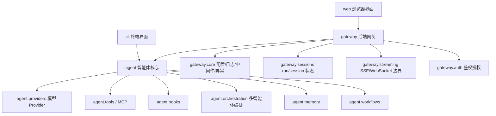

# 框架架构

## 顶层边界

- `agent`: 智能体系统核心。包含 runtime、schema、provider、tool、hook、skill，以及多智能体编排、记忆、工作流等长期演进边界。该层不依赖 FastAPI。
- `gateway`: 后端网关。负责 HTTP API、请求/响应协议转换、鉴权、中间件、异常处理、日志、服务生命周期、SSE 和 Web UI 静态产物挂载。
- `cli`: 终端界面。面向本地交互，直接复用 `agent` 核心能力。
- `web`: 浏览器界面。通过 gateway HTTP/SSE API 调用智能体能力。

## Agent 核心层

- `agent.schema`: Message、ToolCall、ToolSpec、ModelRequest、ModelResponse、RuntimeEvent 等核心数据结构。
- `agent.runtime`: 智能体内核包。`loop` 负责单 Agent 执行循环，`state` 承载运行状态，`prompt` 负责编译模型请求，`session` 负责会话历史，`compaction` 负责上下文窗口，`tool_orchestrator` 负责工具执行边界，`permissions` 负责工具授权策略，`checkpoints` 负责断点恢复存储协议。
- `agent.providers`: 模型客户端、provider adapter、HTTP transport、retry、stream parser 和错误类型。
- `agent.tools`: 工具注册表、本地工具执行、MCP stdio 工具接入。
- `agent.hooks`: Runtime 扩展点，支持意图引导、thinking 提取、审批拦截和组合 hook。
- `agent.skills`: skill manifest、prompt fragment、工具名声明加载。
- `agent.orchestration`: 多智能体 planner/router/supervisor 的归属边界。
- `agent.memory`: session memory 和 long-term memory 的归属边界。
- `agent.workflows`: DAG、计划执行、多步骤任务流的归属边界。

## Gateway 网关层

- `gateway.api`: FastAPI routes、schemas、Agent chat 和 stream API。
- `gateway.core`: settings、logger、middleware、exceptions。
- `gateway.shared.server`: FastAPI 注册器、统一响应、请求 ID、server launcher。
- `gateway.auth`: 鉴权授权边界。
- `gateway.sessions`: HTTP run/session 状态边界。
- `gateway.streaming`: SSE 和 future WebSocket 协议边界。
- `gateway.engines`: 可注册引擎的生命周期管理边界。
- `gateway.static_ui`: 挂载 `web/dist` 到 `/ui/`。

## 调用链

1. `web` 通过 HTTP/SSE 调用 `gateway.api`；`cli` 直接调用 `agent.factory`。
2. `gateway.api` 将请求模型转换成 `agent.factory.create_agent_session()` 参数。
3. `agent.factory` 解析配置，创建 `ModelClient`、`ToolRegistry`、MCP tools 和 hooks。
4. `agent.factory` 把 skill prompt 拼入 system prompt，并把 skill 声明的工具名并入 runtime enabled tools。
5. `agent.runtime.AgentSession` 维护对话历史，并通过 `ContextWindowManager` 控制上下文窗口。
6. `agent.runtime.AgentRuntime` 使用 `RuntimeState` 管理消息、事件、工具结果和 pending tool calls。
7. `PromptCompiler` 编译请求，`ToolOrchestrator` 执行工具，`ToolPermissionPolicy` 判定工具是否可执行，`CheckpointStore` 保存可恢复节点。
8. `gateway` 将结果包装为统一 HTTP 响应或 SSE 事件。

## 新模块接入流程

1. 新增模型能力：放入 `agent/providers/`，并补充 provider adapter 测试。
2. 新增工具能力：放入 `agent/tools/` 或通过 MCP 接入。
3. 新增多智能体编排：放入 `agent/orchestration/`。
4. 新增记忆能力：放入 `agent/memory/`。
5. 新增 HTTP 协议能力：放入 `gateway/api/`，必要时配合 `gateway/sessions/` 或 `gateway/streaming/`。
6. 新增终端交互：放入 `cli/`。
7. 新增浏览器界面：放入 `web/`。
