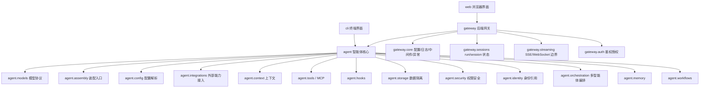

# 框架架构

## 顶层边界

- `agent`: 智能体系统核心。按模型、上下文、工具三条主轴组织，并包含 runtime、storage、security、identity、skill、多智能体编排、记忆和工作流等长期演进边界。该层不依赖 FastAPI。
- `gateway`: 后端网关。负责 HTTP API、请求/响应协议转换、鉴权、中间件、异常处理、日志、服务生命周期、SSE 和 Web UI 静态产物挂载。
- `cli`: 终端界面。面向本地交互，直接复用 `agent` 核心能力。
- `web`: 浏览器界面。通过 gateway HTTP/SSE API 调用智能体能力。

## Agent 核心层

- `agent.schema`: Message、ToolCall、ToolSpec、ModelRequest、ModelResponse、RuntimeEvent 等核心数据结构。
- `agent.assembly`: SDK 装配入口。负责把 settings、模型配置、工具、skills、MCP、workspace、context 和 hooks 组装成 `AgentSession`，并提供 sync/async 两种入口。
- `agent.config`: 配置解析边界。负责模型 provider fallback、API key/base URL/model/proxy 解析。
- `agent.integrations`: 外部能力接入边界。负责 skills 和 MCP 等能力装配。
- `agent.runtime`: 智能体内核包。`loop` 负责单 Agent 执行循环，`turns.model` 负责单轮模型请求，`turns.tools` 负责工具执行边界，`state` 承载运行状态，`session` 负责会话历史，`checkpoints` 负责断点恢复存储协议。
- `agent.models`: 模型协议包。`adapters` 负责 provider wire protocol，`protocol` 负责 provider-neutral stream 语义，`transports` 负责 HTTP/SSE，根层保留模型客户端、retry 和错误类型。
- `agent.context`: 上下文系统。按 system、runtime policy、workspace instructions、skills、memory、tool hints 分层组织上下文，由 `ContextBuilder` 编译并输出 trace；`ModelRequestCompiler` 负责把 runtime state 转为模型请求。
- `agent.storage`: 数据隔离边界。包含 workspace/run/memory/artifact store，当前提供本地 workspace 分配器。
- `agent.security`: 权限与安全边界。包含 tool permission，后续承载 approval、sandbox、secrets、encryption。
- `agent.identity`: 身份引用边界。定义 Principal、Tenant/User/Agent 引用；登录鉴权仍属于 gateway。
- `agent.tools`: 工具注册表、本地工具执行、MCP stdio 工具接入。
- `agent.hooks`: Runtime 扩展点，支持意图引导、thinking 提取、审批拦截和组合 hook。
- `agent.skills`: skill manifest、prompt fragment、工具名声明加载。
- `agent.orchestration`: 多智能体 planner/router/supervisor 的归属边界。
- `agent.memory`: session memory 和 long-term memory 的归属边界。
- `agent.workflows`: DAG、计划执行、多步骤任务流的归属边界。

## Gateway 网关层

- `gateway.api`: FastAPI routes、schemas、Agent chat 和 stream API。
- `gateway.core`: settings、logger、middleware、exceptions。
- `gateway.shared.server`: FastAPI 注册器、统一响应、请求 ID、server launcher。
- `gateway.auth`: 鉴权授权边界。
- `gateway.sessions`: HTTP run/session 状态边界。
- `gateway.streaming`: SSE 和 future WebSocket 协议边界。
- `gateway.engines`: 可注册引擎的生命周期管理边界。
- `gateway.static_ui`: 挂载 `web/dist` 到 `/ui/`。

## 调用链

1. `web` 通过 HTTP/SSE 调用 `gateway.api`；`cli` 直接调用 `agent.factory`。
2. `gateway.api` 将请求模型转换成 `agent.factory.create_agent_session_async()` 参数；CLI 使用同步 `create_agent_session()`。
3. `agent.config` 解析模型配置；`agent.assembly` 创建 `ModelClient`、`ToolRegistry` 和 hooks。
4. `agent.integrations` 装配 skills/MCP；`agent.storage` 根据 `tenant_id / user_id / agent_id / workspace_id` 解析 workspace。
5. `agent.context` 把 system prompt、runtime policy、workspace instructions、skills、tool hints 放入 `ContextPack`，由 `ContextBuilder` 编译为上下文。
6. `agent.runtime.AgentSession` 维护对话历史，并通过 `ContextWindowManager` 控制上下文窗口。
7. `agent.runtime.AgentRuntime` 使用 `RuntimeState` 管理消息、事件、工具结果和 pending tool calls。
8. `ModelRequestCompiler` 编译请求，`runtime.turns.tools.ToolOrchestrator` 执行工具，`ToolPermissionPolicy` 判定工具是否可执行，`CheckpointStore` 保存可恢复节点。
9. `gateway` 将结果包装为统一 HTTP 响应或 SSE 事件。

## 新模块接入流程

1. 新增模型能力：provider 适配放入 `agent/models/adapters/`，通用 stream 协议放入 `agent/models/protocol/`，传输层放入 `agent/models/transports/`。
2. 新增工具能力：放入 `agent/tools/` 或通过 MCP 接入。
3. 新增多智能体编排：放入 `agent/orchestration/`。
4. 新增记忆能力：放入 `agent/memory/`。
5. 新增 HTTP 协议能力：放入 `gateway/api/`，必要时配合 `gateway/sessions/` 或 `gateway/streaming/`。
6. 新增终端交互：放入 `cli/`。
7. 新增浏览器界面：放入 `web/`。
