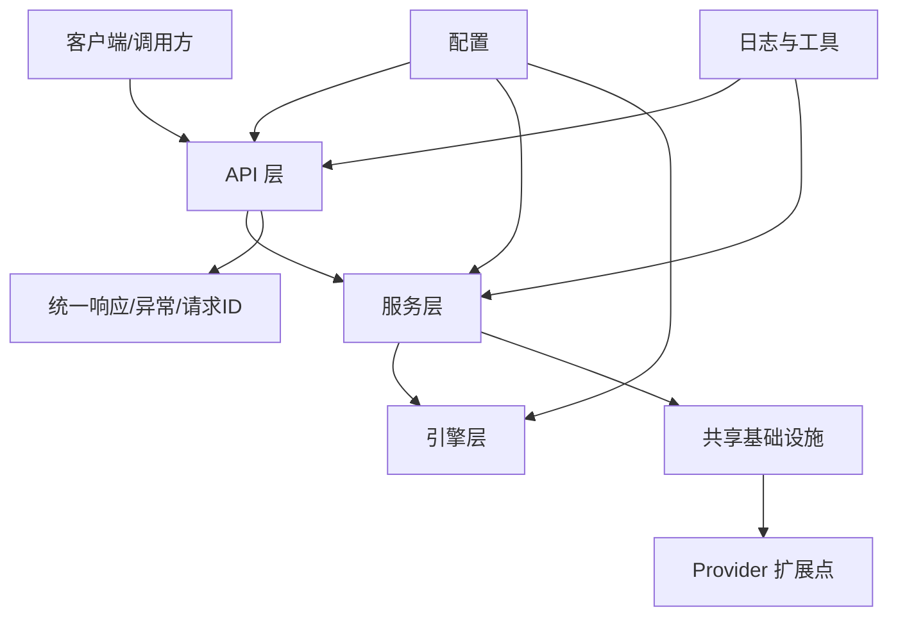

# 框架架构

## 分层说明

- `app.api`: 接口定义、请求模型、路由聚合，只做协议转换和参数校验。
- `app.services`: 业务编排层，负责组合引擎、Provider、数据库和外部服务。
- `app.engines`: 原子能力或模型能力的生命周期管理，支持注册、初始化、重启和调用。
- `app.shared`: 跨模块复用的服务端基础设施、Provider、存储和中间件扩展点。
- `app.core`: 全局配置入口，统一从环境变量和 `.env` 读取。
- `app.utils`: 日志、ID、注册器和通用工具函数。

## 新模块接入流程

1. 创建 `app/api/<module>/schemas.py` 和 `api_<module>.py`。
2. 创建 `app/services/<module>/interface_<module>.py`。
3. 如需独立能力，创建 `app/engines/<module>.py` 并在 `app/engines/registry.py` 注册。
4. 在 `app/api/router.py` 挂载路由。
5. 在 `tests/` 添加接口或服务测试。
